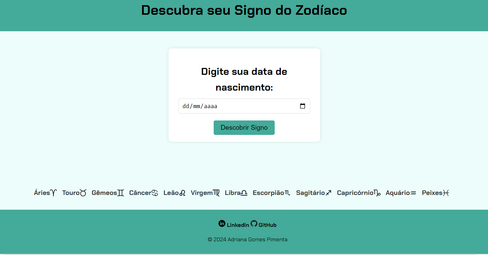

<h1>Descubra Seu Signo do Zodíaco</h1>

Projeto ralizado para a imersão da Alura com o Gemini

<h2>�� Sobre</h2>

É um projeto  que permite ao usuário descobrir seu signo do zodíaco com base em sua data de nascimento.

### Qual é o seu signo? ###
* Descubra agora com esta aplicação simples e intuitiva! Basta inserir sua data de nascimento e explorar o mundo da astrologia.

### Funcionalidades

* **Inserção da data de nascimento**: O usuário pode inserir sua data de nascimento para descobrir seu signo.
* **Símbolos dos signos**: Cada signo tem um ícone correspondente exibido ao lado de seu nome.
* **Descrição do signo**: Para cada signo, é exibida uma descrição personalizada.
* **Responsividade**: A página é responsiva, adaptando-se a diferentes tamanhos de tela.
* **Cálculo preciso:** Calcula o seu signo com base na data de nascimento.

**Links:**
* **Descubra seu Signo:** https://descobrindo-signo.vercel.app/
* **LinkedIn:** [https://www.linkedin.com/in/seu_nome_de_usuario](https://linkedin.com/in/adriana-pimenta-0a956a268)
* **GitHub:** [https://github.com/seu_nome_de_usuario](https://github.com/AdrianaGomesPimenta)
   
### Imagem do site

## �� Tecnologias

  
  
  

